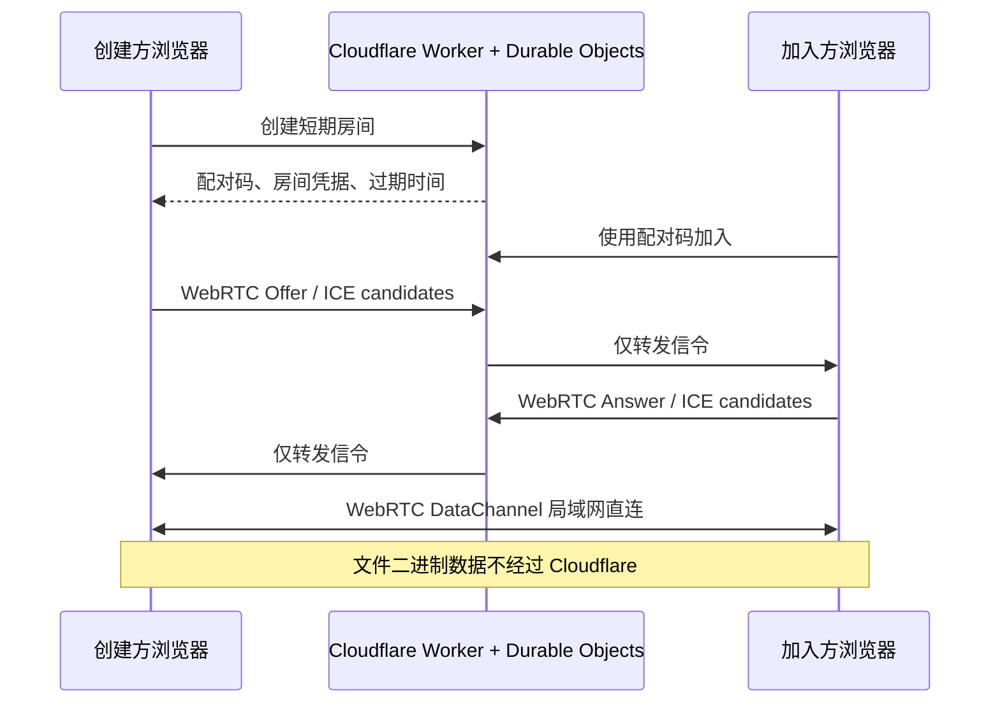

# 糯米饭快传 RiceDrop

> 无需安装客户端的局域网点对点文件传输工具。

[](https://workers.cloudflare.com/)
[](https://webrtc.org/)
[](#测试与验证)

**在线使用：[https://f.wzrice.cn](https://f.wzrice.cn)**

糯米饭快传（英文名 **RiceDrop**）是一款基于浏览器的局域网文件互传工具。两台设备通过三位数字配对码或携带配对码的链接相遇，建立 WebRTC DataChannel 后直接传输文件。Cloudflare 只负责页面托管、短期房间状态和 WebRTC 信令交换，**不接收、存储或中转文件内容**。

## 核心特性

- 无需注册、安装客户端或上传云盘。
- 三位数字配对码，支持二维码和一键复制加入链接。
- 输入完整配对码后自动连接，无人工审批步骤。
- 配对后双方对等，均可连续发送、接收、拒绝或取消文件。
- 多文件队列，最新传输项显示在列表顶部。
- 显示进度、整数字节大小、速度和独立的预计剩余时间。
- 每个文件都可单独取消；取消后需从头重新发送。
- 小文件使用内存接收，大文件使用边接收边写盘的流式模式。
- 单文件上限 10 GB；512 MB 及以上需电脑端 Chrome 或 Edge 接收。
- 移动端图片和视频提供预览与长按保存备用方案。
- 识别微信、QQ 及常见内置 WebView，引导切换 Chrome 或 Edge。
- 未知 Android 浏览器显示风险警告，由用户选择是否继续。
- 加入失败、取消或断开时，创建方可保持原配对码自动恢复等待。
- 频繁创建或加入时使用 Cloudflare Turnstile 进行人机验证。
- 简体中文、English 和日本語三语页面，不同语言的设备可正常配对。
- 内置 canonical、hreflang、Open Graph、JSON-LD、robots.txt 和 sitemap.xml。

## 使用方法

1. 两台设备连接同一局域网。
2. 设备 A 打开网站，点击“开始传输”。
3. 将加入链接、二维码或三位配对码交给设备 B。
4. 设备 B 打开链接、扫码，或输入配对码。
5. 显示“局域网直连成功”后，任意一方即可选择或拖放文件。
6. 接收方确认接收或拒绝。大文件需先选择本地保存位置。
7. 完成后可继续互传，或点击“断开连接”结束会话。

## 工作原理



### Cloudflare 侧

- **Worker Static Assets**：托管网页、脚本、图标和 SEO 文件。
- **PairingDirectory Durable Object**：维护配对码 SHA-256 摘要、房间 ID、过期时间和 IP 级频率。
- **TransferRoom Durable Object**：维护单个房间的临时令牌、设备信息、WebSocket 和信令状态。
- **Turnstile**：仅在频繁操作后验证，通过后自动继续原操作。

项目不使用 R2、KV、文件数据库或 TURN 中转文件。Durable Object 存储的是短期配对和连接状态，不是文件内容。

### 浏览器侧

- `RTCPeerConnection({ iceServers: [] })` 禁止配置 STUN/TURN。
- DataChannel 建立后检查实际 ICE candidate pair，发现 `relay` 或无法确认直连时中止。
- 控制消息使用 JSON，文件使用带文件 ID 和序号的二进制帧。
- 默认按 64 KiB 分片，使用 DataChannel `bufferedAmount` 背压。
- 大文件每写入 4 MiB 返回确认，防止网络快于磁盘导致内存堆积。

## 隐私与安全边界

- 文件内容只在两台设备的 WebRTC DataChannel 中传输。
- 服务端没有文件上传或转发 API；WebRTC 传输由浏览器强制加密。
- 配对码以 SHA-256 摘要登记，房间凭据使用密码学随机数生成。
- 信令消息上限 64 KiB，且只允许白名单内的协议类型。
- 创建和加入有 IP 级频率保护，超限后由 Turnstile 放行单次操作。
- 日志不应记录文件内容、明文配对码、完整 SDP 或 ICE candidate。

> [!IMPORTANT]
> “不经过公网服务器中转”不等于“建连过程完全离线”。双方仍需访问 Cloudflare 以加载页面、加入短期房间并交换 WebRTC 信令。

## 配对与会话恢复

- 配对码等待期默认为 3 分钟，超时后可保持原码继续等待 3 分钟。
- 加入后未成功建立 DataChannel 时，超时会使创建方自动恢复原房间。
- 加入方在连通前取消或关闭页面，创建方会恢复原配对码等待。
- 信令 WebSocket 短暂断开时保留 5 秒宽限。
- 已建立文件传输连接后，任意一方退出会结束会话，不会自动重开房间。

## 文件大小与兼容性

| 场景 | 接收方要求 | 处理方式 |
|---|---|---|
| 小于 512 MB | 现代浏览器 | 内存分片接收，完成后下载、分享或预览 |
| 512 MB – 10 GB | 电脑端 Chrome / Edge、HTTPS、File System Access API | 选择保存位置，边接收边写盘 |
| 超过 10 GB | 不支持 | 发送前拦截 |
| 微信、QQ 等已知内置 WebView | 不支持 | 禁止配对，引导使用 Chrome / Edge |
| 未知 Android 浏览器 | 未确认 | 显示警告，允许用户继续 |

大文件不会把完整内容放入内存，但仍受磁盘空间、File System Access API、网络稳定性和设备休眠策略影响。当前不支持断点续传。

## 网络要求与已知限制

- 双方必须能建立直接 WebRTC 连接。同一 Wi-Fi 是最容易成功的环境。
- 不同子网不一定无法传输；如果路由、防火墙和 NAT 允许双向连通，仍可能成功。
- 访客 Wi-Fi、AP/Client Isolation、严格防火墙、双重 NAT 或跨子网单向路由可能导致失败。
- 不配置 TURN，不会为了连通而改用公网文件中转。
- 浏览器标准不提供可靠的 Wi-Fi SSID 读取能力。
- 当前房间只允许两台设备，不支持多方广播。
- 刷新、关闭页面或网络中断可能使当前文件需从头重新发送。

## 多语言与 SEO

| 语言 | 路径 | 品牌名 |
|---|---|---|
| 简体中文 | `/` | 糯米饭快传 |
| English | `/en/` | RiceDrop |
| 日本語 | `/ja/` | RiceDrop |

语言只影响界面文案，不改变房间和传输协议。SEO 资源包括 `robots.txt`、`sitemap.xml`、canonical、hreflang、Open Graph、Twitter Card、`WebSite` / `Organization` / `WebApplication` JSON-LD 和多格式站点图标。

## 项目结构

```text
.
├── docs/                  # 产品需求与技术设计资料
├── public/                # 静态站点和浏览器端模块
│   ├── app.js             # UI、配对、会话和保存流程
│   ├── webrtc.js          # 局域网 WebRTC 连接
│   ├── transfer.js        # 分片、背压、确认、取消与写盘
│   └── environment.js     # 浏览器和保存能力检测
├── scripts/build-site.mjs # 生成多语言页面与 SEO 文件
├── site/                  # 页面模板与多语言文案
├── src/                   # Worker、Durable Objects、协议和 Turnstile
├── test/                  # Node.js 自动化测试
├── package.json
└── wrangler.jsonc
```

## 本地开发

### 前置要求

- Node.js 20+
- pnpm（推荐）或 npm
- Cloudflare 账号与 Wrangler 登录状态

```bash
git clone https://github.com/ChillyMand/ricedrop.git
cd ricedrop
pnpm install
pnpm run build
pnpm run dev
```

### 常用命令

```bash
pnpm run build    # 根据 site/ 生成 public/
pnpm test         # 运行全部测试
pnpm run check    # 构建 + 测试 + Wrangler dry-run
pnpm run dev      # 构建并启动本地 Worker
pnpm run deploy   # 构建、测试并部署
```

## Cloudflare 部署

仓库不包含 Cloudflare Account ID、Turnstile Secret 或任何部署凭据。

1. 登录：`pnpm exec wrangler login`。
2. 在 Cloudflare Turnstile 创建组件，将允许主机名设为自己的域名。
3. 在 `public/app.js` 将 `TURNSTILE_SITE_KEY` 换成自己的公开 Site Key。
4. 使用 `pnpm exec wrangler secret put TURNSTILE_SECRET` 交互式保存 Secret，不要写入源码。
5. 修改 `wrangler.jsonc` 的 Worker 名称和 `routes` 自定义域名。当前示例为 `f.wzrice.cn`。
6. 运行 `pnpm run check` 验证，然后运行 `pnpm run deploy`。

`wrangler.jsonc` 会创建两个 SQLite Durable Object 类并绑定静态资源。首次部署时 Wrangler 会根据 `migrations` 执行迁移。

## 测试与验证

当前共 72 项 Node.js 自动化测试，覆盖：

- Worker、Durable Object、Custom Domain 和静态资源配置。
- 配对码、摘要、强随机令牌、信令白名单和大小限制。
- 创建、加入、超时、断线宽限与原配对码恢复。
- WebRTC 严格直连和无文件上传路由约束。
- 文件分片、背压、写入确认、取消和兼容性原因同步。
- 多种浏览器、微信、QQ、WebView 与移动保存能力。
- 三语文案合同、语言路由、SEO、sitemap 和 robots.txt。
- Turnstile 操作、主机名、无效令牌和单次放行策略。

提交或部署前运行：

```bash
pnpm run check
```

## 设计文档

- [产品需求文档](docs/product-requirements.md)
- [技术设计](docs/technical-design.md)
- [会话恢复设计](docs/session-recovery-design.md)
- [微信浏览器与 10GB 大文件设计](docs/wechat-large-files-design.md)

> [!NOTE]
> 产品需求文档保留了 MVP 早期探索流程。如与当前 README 或代码不一致，以当前代码和测试为准。

## 当前范围与后续方向

当前是两设备房间，已实现双向、多文件互传。未实现多方传输、断点续传、文件夹目录结构、账号系统、离线收件箱或公网文件中转。

多方传输如使用纯 P2P 网状结构，发送方需对每个接收方分别发送一份数据，速度会受发送方局域网上行、CPU 和浏览器资源共同限制。该能力仍处于后续评估阶段。

## 品牌

- 中文名：糯米饭快传
- 英文名：RiceDrop
- 所属站点：[WZRICE.CN](https://wzrice.cn)
- 在线产品：[https://f.wzrice.cn](https://f.wzrice.cn)

Copyright © 2026 WZRICE.CN. All rights reserved.
